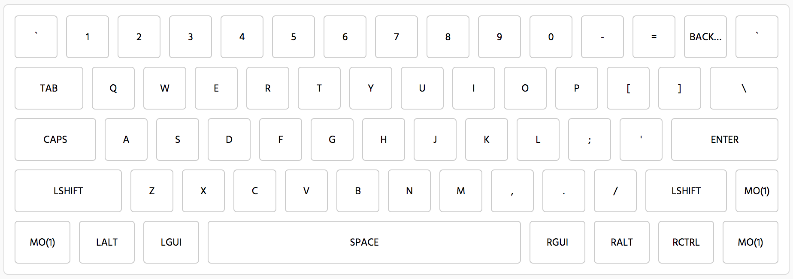

Spaceman Spiff layout for GH60



This repo was created for a [GH60 Satan](https://1upkeyboards.com/gh60-satan-pcb.html) (a.k.a. RevCHN or GH60 China), which uses a `atmega32u4` microcontroller.

Layout created with http://kbfirmware.com/

The layout files can be found in `gh60spacemanspiff.hex` and flashed to the keyboard using the [QMK toolbox](https://github.com/qmk/qmk_toolbox) GUI App or via the command line with the `flash.sh` script.

The flash script requires `dfu-programmer` to be installed:

```
brew install dfu-programmer
```


